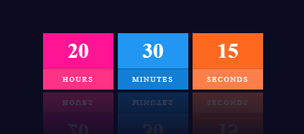

# Food-to-cart-website
A responsive dark theme website using HTML5, CSS3, and JS - A well-known scripting language for webpage creation.

# Table of contents
[Overview](#view)
 
[Built with](#built)
 
[Features](#features)

[Additional](#additionals)
 
[Credits](#credits)

 
# Overview
The food-to-cart website is a model website based on food content and gives an overview of web creation and has customized for all media queries, including iPhone, Tab, Mobile, and Desktop.

# Built with
- Semantic HTML5 markup
- CSS custom properties
- JavaScript
- Designing Software - Visual Studio Code
- Web Browser - Google (Default), optional
- Responsiveness

# Features
- Flexbox
- CSS Grid
- Search bar
- Internal links 
- Email fields
- Social media contact icons
- Message field
- Zoom-in-out on hover

# Additional
- Sliders
- Swipers
- Live Calendar:

    
   
- Live clock:

    
   
- Pre-Loader:

    
    
- Swipe-up login page

  
# Credits

Coded by [Yamuna Raja Webunnydev](https://github.com/Webunnydev).
